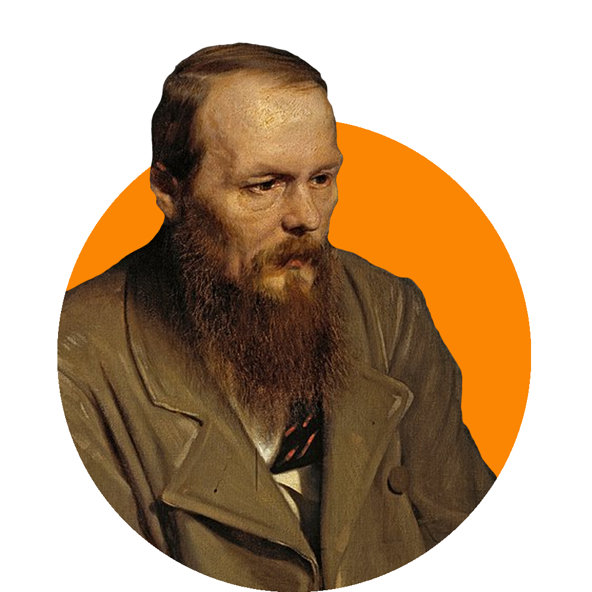
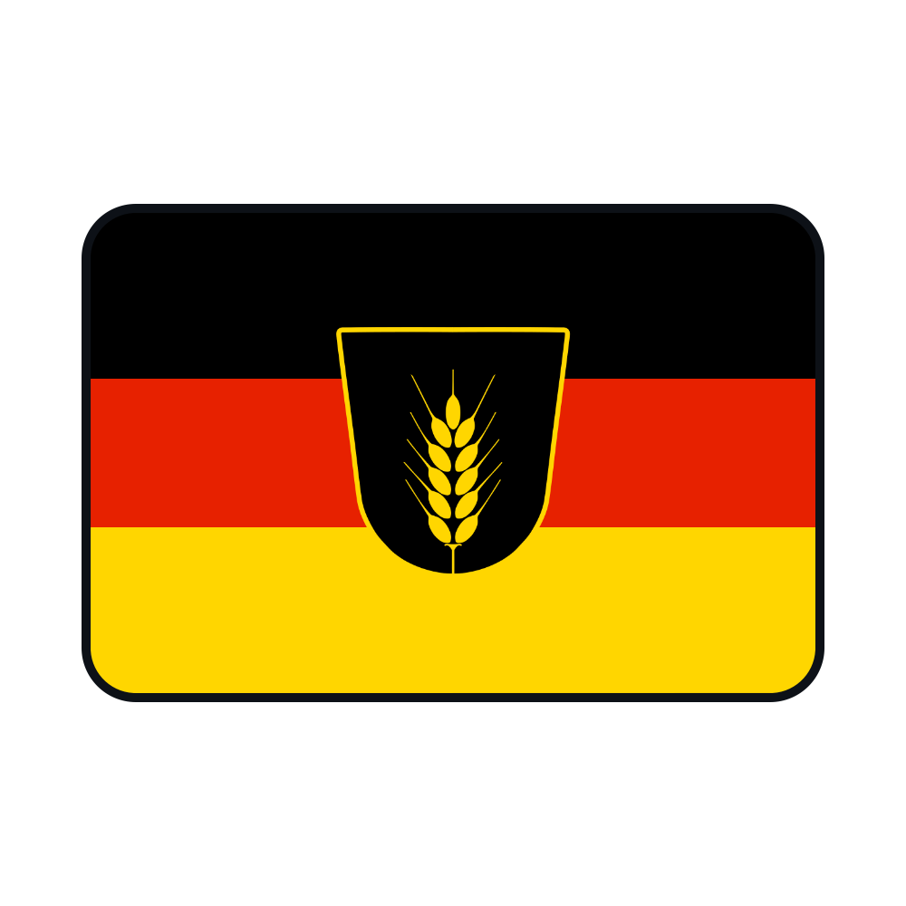

	
	
  
	
«Так просто быть умным. Я свой мозг оставил где-то на Думской»

  
✦balbescore✦

---

  
:bangbang: Utopist and people lover

  
:open_file_folder: Beginning Game Director and scriptwriter. Github for FOSS collection and cuz’ learning in programming college (should have gone to design or smth else);

  
:speaking_head: I'm speaking English(B1) and Russian(Native). Want to learn German and Esperanto (can’t get start);

  
:love_letter: Esperanto as a second language for Europe (worldwide)

  
:sparkles: Will live in trash in future!

